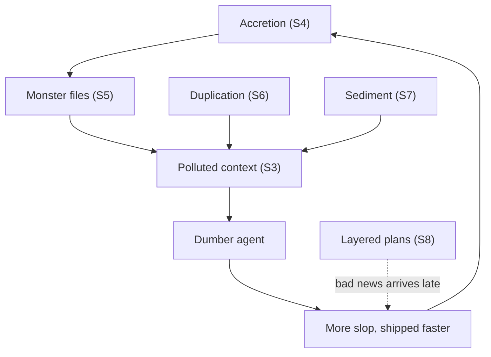
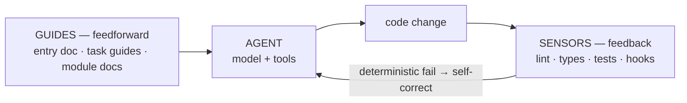

# Harness Engineering: Optimizing Your Codebase for AI Is Optimizing It for People

Status: Authoritative deck text (reworked 2026-07-17)
Date: 2026-07-17

> Slide deck text. 23 slides, ~30 min talk. Audience: engineers AND engineering leadership.
> **Reworked 2026-07-17** (supersedes the 2026-06-15 deck): the talk now opens with the
> anti-patterns of agentic development (Act I), then lands the AI-ready = onboarding-ready
> reframe (Act II), then walks the harness mechanisms (Act III).
> **De-cased 2026-07-17:** the talk carries no case-study or repo-specific references at
> all — no "in one real codebase" framing, no repo-derived figures, no named internal
> rules. Act III teaches each mechanism as a general practice any team can adopt; every
> concrete example is a pattern anyone can build, not an observation of one repo. The
> closing slide offers a public resources repo (github.com/hansborr/ai_devx_stuff) as
> further reading. Former slides 21 ("system, not a pile of tools") and 23 ("proven vs.
> directional") are removed and the deck renumbered from 25 to 23 slides.
> **Format change:** slide faces are deliberately sparse — a title and at most ~4 short
> lines. All evidence, numbers, citations, and delivery guidance live in the speaker notes.
> Evidence-tier tags — **(peer-reviewed)** / **(vendor/correlational)** / **(illustrative)**
> / **(directional)** — now live in the notes; voice them when quoting a stat, and put the
> tag on the face only if you show the number on the face.
> **Delivery layer 2026-07-17:** slide 10 split into 10 (thesis) + 11 (evidence); a
> day-of checklist and cut plan sit below; dense slides open with a
> **Must-land:** line; **Leadership:** lines are voiced only where marked "(voice this)";
> slides 9 and 12 carry visual specs for the slide build.
> **Reordered 2026-07-17:** context rot now opens Act I as slide 3, followed by accretion (4)
> and monster files (5) — the mechanism precedes the anti-patterns it explains; slide 1
> gains a brief memory-system caveat bullet.

## Day-of speaker checklist

- [ ] Slide 23: confirm github.com/hansborr/ai_devx_stuff is public and its README presentable before offering it.

## Cut plan (delivery)

Full-content delivery of all 23 slides runs well past 30 minutes; plan the cuts, don't improvise them. Checkpoint: be on slide 10 by minute 12.

- The dense slides (3, 9, 17, 18, 19) each open their notes with a **Must-land:** line; everything after that line is expendable to the clock.
- Collapse order if behind at the checkpoint: (1) deliver slides 6–7 as one beat — the GitClear trend line and the note-about-a-note move, dropping the panel anecdote; (2) slide 14 → the facade example only, skipping the taxonomy paragraph; (3) slide 18 → the baseline mechanic only, skipping the tooling and escape-hatch paragraphs.
- **Leadership:** lines are prep aids, not script — voice only the ones marked "(voice this)" (slides 1, 9, 11, 12, 20, 22) so the strand lands without becoming a tic.
- The collapses double as the Q&A buffer: landing at ~25 minutes leaves five for questions — plan for that outcome rather than treating it as a failure.

---

## Slide 1 — Your new teammate has no memory

**Face:**
- An AI coding agent = a sharp new hire with amnesia
- It shows up 20+ times a day, knowing nothing from last time
- Yes, there are memory features — unreliable today, and they can make it *worse*
- Take that seriously, and everything else in this talk follows

**Speaker notes:** Set the frame in 30 seconds, no jargon. A coding agent is an LLM plus tools in a loop (Simon Willison); every session it joins your team fresh, with zero memory of the last session. Pre-empt the obvious objection in one breath: Claude does ship a memory system, but it's a partial fix at best — recalled notes go stale, everything remembered is spent from the same limited context budget, and stale or irrelevant memories actively degrade performance (a preview of slide 3's context tax). The amnesia frame stands. Picture not a 10x engineer but a brand-new teammate with amnesia who arrives dozens of times a day. Everything in this talk follows from taking that seriously. Act III teaches mechanisms and general practice, not any particular project; a pointer to further resources comes on the closing slide, unannounced until then. **Leadership (voice this):** this is not an "AI line item" talk; the investment that makes agents effective is the same one that makes human hires productive faster.

---

## Slide 2 — Agenda

**Face:**
- I. How agentic development goes wrong
- II. The reframe: AI-ready = onboarding-ready
- III. The harness: guides + sensors, mechanism by mechanism

**Speaker notes:** Twenty seconds. Act I is failure modes you will recognize if you've used these tools for more than a week — no vocabulary needed yet. Act II is the one idea to remember. Act III is the mechanism tour (lint and tests get the most time — cheapest guardrail and behavior backbone respectively), closing with where to start on Monday.

---

## Slide 3 — A fuller context window makes the model dumber

**Face:**
- LLM accuracy degrades as the context window fills
- Much of what's in there is invisible to you
- Anthropic cut 80% of Claude Code's system prompt — and it got *better* **(vendor)**

**Must-land:** the same model gets measurably dumber as its window fills — and even Anthropic paid this tax (the 80% system-prompt cut).

**Speaker notes:** The mechanism comes first — establish it here and every anti-pattern that follows has its *why*. *Context rot* — the same model gets measurably less accurate as its window fills — is documented across 18 models (Chroma) **(vendor/correlational)**. And you mostly can't see what's in the window: system prompt, tool schemas, hook outputs, auto-loaded project files, prior tool results — Claude Code makes it genuinely hard to inspect, and there is a surprising amount of junk the model trawls through on every single turn unless you dig. The fun proof that even Anthropic got this wrong: until recently, Anthropic's own models benchmarked measurably *worse inside Claude Code* than outside it — an open-source harness beat Claude Code on frontier tasks (Latch.bio), and one same-model comparison scored 77% in Claude Code vs 93% in Cursor **(directional, independent tests)**. Anthropic's own April 2026 postmortem traced one regression to a single added system-prompt line ("keep text between tool calls to ≤25 words") — one sentence of well-intended instruction made the model measurably dumber **(vendor postmortem)**. Their response: they cut the Claude Code system prompt by ~80% (from ~800 tokens to 164), saying the new models "want a smaller system prompt" — and the leaner version tested as well or better **(vendor)**. Punchline to deliver: *every token in the window is a tax; the vendor pays it too.* **Leadership:** context is a budget. Teams that treat it that way get a smarter agent for free.

---

## Slide 4 — It builds and builds — and never steps back

**Face:**
- Agents add; they don't step back and refactor
- Every task solved by *more* code on top
- Complexity compounds until no one can reason about it

**Speaker notes:** First anti-pattern, told from experience before any stat: an agent will happily complete task after task by accretion — another branch, another parameter, another special case — and it will essentially never say "this file has grown incoherent, let me restructure before continuing." A human senior dev alternates between building and consolidating; the agent only builds. The result is code that is locally plausible and globally incoherent, and it eventually becomes unmaintainable and untestable — *even for the AI itself*. The measured version: **SlopCodeBench v2** (arXiv 2603.24755, Mar 2026): across 15 agents, **77%** of trajectories show rising structural erosion and **75.5%** rising verbosity; agent code came out ~2.3x more verbose and ~2.0x more eroded than matched open-source Python repos **(peer-reviewed)**. CMU's 807-repo study: +30% static warnings, +41% complexity after AI adoption, persistent **(peer-reviewed)**. **Leadership:** this is compounding structural debt, not occasional bad lines — the interest rate is the problem.

---

## Slide 5 — The file too long for the AI that wrote it

**Face:**
- Endless accretion → thousand-line files
- Claude Code truncates large file reads
- The agent can still read it all — in pieces, at a context price, every session

**Speaker notes:** The concrete, slightly absurd endpoint of slide 4. Agent-grown files get so long that the harness's own safety mechanisms kick in: Claude Code truncates large file reads by default (about 2,000 lines per read) — a deliberate Anthropic control to keep junk from flooding the context window. The irony: that control exists to prevent context pollution, but here the spaghetti *is* the pollution. Be precise here — a skeptic will check: the agent *can* still read the whole file by paging through it in chunks, but every pass spends a large slice of the context window on its own spaghetti, so in practice it edits from partial views — which produces more duplication and more incoherence, which makes the file longer. A self-tightening knot. This is also why "just let it run" degrades: each session starts by re-reading the mess the last session left. The *why this matters* mechanism is slide 3's context rot — call it back explicitly here. **Leadership:** file size sounds like a style nit; for agents it is an operational cost — past a threshold, maintaining the file means burning the context budget the agent needed for the actual task, every single session.

---

## Slide 6 — Copy, paste, repeat

**Face:**
- Agents duplicate instead of abstracting
- Change a button color → edit it in 10 places, miss one
- 2024: first year duplicated code outpaced refactoring **(vendor/correlational)**

**Speaker notes:** The agent's cheapest way to satisfy "make it work here too" is to paste the code again — it costs the model nothing at generation time and costs you everything at maintenance time. The vibe-coding-panel anecdote: a fully auto-merged, no-review codebase where changing a button color meant editing ten call sites and missing one; that codebase hit "we have to trash this and rewrite" in about two weeks **(illustrative, named panel)**. The trend line: **GitClear** (211M changed lines, 2024 data): copy-pasted code rose to 12.3% of changed lines, and 2024 was the first year duplication exceeded refactoring — cite as a trend, not a 2026 magnitude **(vendor/correlational)**. Duplication is also context pollution (slide 3 callback): every near-copy is more tokens the next session must read to answer "which of these is the real one?" **Leadership:** duplication is the doom loop's compound interest — it grows silently, and every copy makes the next agent session slower and wronger.

---

## Slide 7 — Nothing ever gets deleted

**Face:**
- AI is reluctant to fully delete anything
- It doesn't remove the stale note — it adds a note saying the note is stale
- Dead plans, dead comments, dead docs = sediment

**Speaker notes:** The most insidious anti-pattern because it masquerades as caution. Agents will work around code rather than remove it, keep both versions "for safety," and append rather than prune — in code, in docs, in plans, in their own memory files. The signature move: it writes "temporarily using Foo until Bar is implemented"; later, with Bar done, it does not *delete the note* — it adds a second note explaining the first note no longer applies. Now the next reader (human or agent) must parse both, plus the workaround that's still in place. Repeat for months and the codebase accumulates sediment: layers of dead text that no longer describe anything true, all of it feeding straight back into the context window as pollution (slide 3, again). Stale docs are worse than no docs — a human shrugs at a slightly-wrong README; an agent confidently follows it off a cliff. **Leadership:** deletion is a discipline that AI does not supply. If nothing in your process forces pruning, entropy only accumulates.

---

## Slide 8 — Big flat layers, bad news late

**Face:**
- Agents plan bottom-up in horizontal layers
- Schema → models → services → API → UI… then it finally runs
- Design flaws surface at the end, when they're most expensive

**Speaker notes:** Ask an agent to plan a feature and you'll usually get a layer cake: all the schema work, then all the data-access work, then all the services, then the API, then the UI — each layer "complete" before the next begins. Nothing end-to-end runs until nearly everything exists, so the design isn't *tested by reality* until the most expensive possible moment; a wrong assumption in layer one is discovered after four layers were built on top of it. The classic remedy is old: tracer bullets (Pragmatic Programmer), walking skeleton, vertical slices — build one thin end-to-end path first, learn, then widen **(practitioner consensus)**. Agents don't do this by default; horizontal layering *feels* systematic, and the agent optimizes for producing a complete-looking plan, not for early feedback. You have to impose slicing on it — in the plan you approve, and in the harness (a fast end-to-end check the agent runs from the first hour). **Leadership:** this is the same reason waterfall lost to iteration — AI quietly reintroduces waterfall unless you stop it.

---

## Slide 9 — Cognitive debt: the doom loop's last casualty is you

**Face:**
- Every slide so far compounds the others
- "Your codebase regresses to your worst engineer"
- The less you understand it, the less you can steer
- *(visual: the doom-loop diagram — six anti-patterns, one cycle)*

**Must-land:** the six anti-patterns compound into one loop, and its last casualty is your own understanding of the codebase.

**Speaker notes:** Act I closer — tie the six anti-patterns into the loop. Complexity (4) grows files (5) that pollute context (3); duplication (6) and sediment (7) pollute it further; layered plans (8) delay the reckoning. Each makes the others worse, and output quality degrades while volume stays high — *"your codebase regresses to your worst engineer,"* then the AI *"exponentially grows this slop"* (vibe-coding panel, **illustrative**). The two-week trash horizon from slide 6 is the terminal state. And the final casualty is the human: the longer you ride this loop, the less of your own codebase you understand — so you review shallower, catch less, steer worse, depend more. Cognitive debt builds fast; an MIT Media Lab study found measurably reduced engagement and recall when people leaned on an LLM for writing tasks — adjacent evidence, not a coding study **(directional)** — and the practitioner term "comprehension debt" names the same thing for code. Delivery-layer echo: CircleCI 2026 (28M+ workflows) — work ships faster but merges slower; median main-branch pipeline success at a 5-year low of 70.8% **(vendor/correlational)**. Five unreviewed AI "improvement" passes raised critical vulnerabilities +37.6% (IEEE-ISTAS RCT) **(peer-reviewed)**. **Leadership (voice this):** unreviewed AI velocity has a short shelf life; you can ship fast and accrue a rewrite-liability simultaneously. Speed without a harness is borrowed, not earned.

**Visual spec (for the slide build):** the face *is* the diagram — a closed loop with the human outside it. Caption: *each revolution, you understand less.*

---

## Slide 10 — Every one of those is an onboarding failure

**Face:**
- Re-read Act I as a story about a new hire
- No orientation, no code review, no cleanup culture, no feedback
- AI-ready = onboarding-ready

**Speaker notes:** The reframe — the talk's thesis, stated once, here. *Delivery: drop the tempo — this is the hinge of the talk; pause before and after the thesis line rather than moving at mechanism-tour pace.* Run Act I back as a story about a human: a new hire nobody oriented (context pollution), nobody code-reviewed (complexity, duplication), nobody taught the team's cleanup culture (sediment), whose designs nobody sanity-checked early (layers) — of course it went badly; you'd blame the onboarding, not the hire. *"AI is not a super-powered developer. It's a new starter with no memory… What works for humans is also great for AI"* (Matt Pocock). *"The Venn diagram of 'readable to humans' and 'readable to machines' has massive overlap"* (Tian Pan). Both consumers share the same two constraints: limited working context and zero prior knowledge of your conventions. Let the thesis line land; the evidence and the honest caveat get the next slide.

---

## Slide 11 — One budget, double return

**Face:**
- AI is an amplifier: it magnifies strengths *and* dysfunctions
- Honest caveat: AI-ready is a *superset* of onboarding-ready
- The same dollar speeds human onboarding and makes AI safe

**Speaker notes:** The evidence half of the reframe, delivered after the thesis has had its beat. Ousterhout: design matters *more* in the AI era, because AI generates maintainability debt fast — deep modules minimize cognitive load on *whoever* consumes them. **DORA 2025** for the leadership half: AI is an amplifier with a stability tax — it lifts throughput but degrades delivery stability *unless* strong foundations absorb it; it magnifies disciplined teams' strengths and struggling teams' dysfunctions **(peer-reviewed, large-N)**. Honest caveat, briefly: AI-ready is a *superset* of onboarding-ready — agents add machine-specific needs and build no durable mental model. But the shared core — low cognitive load, no surprises — is identical. **Leadership (voice this):** one budget, double return — the same dollar speeds human onboarding and makes AI safe.

---

## Slide 12 — Agent = Model + Harness

**Face:**
- The harness = everything around the model — and you own it
- Guides steer *before*; sensors correct *after*
- A failing check is the one signal the model can't argue with
- *(visual: the guides → agent → sensors loop)*

**Speaker notes:** Vocabulary for Act III, defined once. The *harness* is "everything in an AI agent except the model itself" (Böckeler, Thoughtworks) — the field-standard term. Two halves used all talk: **guides** = feedforward (AGENTS.md, docs, conventions — steer before the agent acts); **sensors** = feedback (linters, type checks, tests — observe after, so it self-corrects). The key property: deterministic enforcement beats probabilistic prompting — a check that fails the same way every time is the one signal the model cannot argue with. The directional hook: one team reported swapping the *harness* moved a SWE-bench score ~22 points while swapping the *model* moved ~1 **(directional — Morph, one team's number, not a controlled benchmark)**; the durable version of that point is slide 3's vendor-scale evidence that harness quality moves outcomes, and that current leaderboards reshuffle by harness and dataset — so measure against *your* repo, not a leaderboard. **Leadership (voice this):** the competitive lever is the harness you build, not the model vendor you pick — you own it, can invest in it, and keep it when models change. And it matters *more* as models improve: a more capable blocked agent tries harder to route around a soft boundary, which is exactly why deterministic, human-owned gates matter more in mid-2026 than a year ago.

**Visual spec (for the slide build):**

---

## Slide 13 — Orientation: a pointer at the top, recipes below

**Face:**
- Always-loaded context is a budget, not a dumping ground
- CLAUDE.md/AGENTS.md files often make models measurably *worse* in real codebases **(controlled study)**
- A short entry doc that *routes* → task guides → module docs

**Speaker notes:** First mechanism, countering slide 3 (context pollution) directly. Treat always-loaded context like scarce memory: make the tool-specific entry file a one-line pointer to a shared `AGENTS.md`; keep that entry doc short — tens of lines, not hundreds — and make it *route* ("see the task guide before schema, API, or async changes") rather than inline detail; push the depth into task guides and per-module docs that answer what a senior dev would brief a newcomer on: where do I start, what owns state, what must not drift. Then *enforce* the compactness: a hook or CI check that caps the always-loaded docs at a line budget — with the rationale in its own failure message ("this is loaded into every session's context; push detail into linked docs") — turns the discipline from an intention into a gate. This is the field consensus operationalized: keep always-loaded context to "the smallest possible set of high-signal tokens" (Anthropic); GitHub's 2,500-repo study found most agent files fail by being too *vague* — routing beats dumping **(vendor studies)**. The face bullet's sharper claim: ETH Zurich's AGENTBENCH (arXiv 2602.11988, ~138 real-repo tasks) found repo context files — LLM-generated ones worst — tend to *reduce* task success versus no file at all while raising inference cost over 20%, because agents obey noisy instructions too faithfully; cite the direction confidently, hedge exact deltas (secondary summaries overstate them). The counterweight (arXiv 2601.20404, 10 repos / 124 PRs): a hand-curated `AGENTS.md` cut median runtime ~29% with comparable completion. Reconciliation to voice: it's a *quality* question, not an existence one — a tight, developer-authored file helps; a bloated or auto-generated one actively hurts, which is exactly why the budget is treated as scarce. Onboarding mirror: a good README routes you; a senior hands you a recipe; module docs tell you where state lives. **Leadership:** cheap to build, compounds daily — every session (human or agent) starts oriented instead of lost.

---

## Slide 14 — Deep modules, and files kept readable by force

**Face:**
- One thin interface, complexity hidden behind it
- Folders are earned, not defaulted
- File length is a *gate*, with a tracked exceptions list

**Speaker notes:** Counters slides 4–5 (complexity accretion, monster files). Ousterhout's deep module made structural: give a complex domain a named, logic-bearing facade — a handful of entry points hiding the internal files — so callers (human or agent) import one thing and ignore the rest. Distinguish that from a dumb re-export `index.ts` barrel, which hides the dependency graph and wrecks tree-shaking; barrels are worth banning outright with a lint rule (a preview of slide 17) — a logic-bearing facade passes, a barrel doesn't. Govern sprawl with an explicit where-does-code-go contract: a short written taxonomy of module kinds, plus a promote-only-when-criteria-hold rubric for graduating code between them — the contract that stops both junior sprawl and agent slop. And the direct answer to slide 5: enforce file length as a gate with a tracked exceptions list, so oversized files are either split or carry an explicit, visible exception; the agent cannot silently grow a 2,000-line file. **Leadership:** module boundaries are a cost-control lever — bad structure makes AI accelerate complexity *and* burns tokens; good structure makes comprehension and agent cost cheaper at once.

---

## Slide 15 — Docs that can't lie (for long)

**Face:**
- Stale docs are worse than none — agents follow them off cliffs
- So every guide gets a sensor that checks it's still true
- Freshness checks, path validators, index checks — docs made falsifiable

**Speaker notes:** Counters slide 7 (sediment). The principle: feedforward docs get paired feedback sensors, so they cannot silently rot — because an agent, unlike a human, will *confidently execute* a stale doc. The sensors are cheap and mechanical: freshness checks that flag a doc older than the code it describes, path validators that fail when a doc references a file that no longer exists, index checks that fail when a module loses its doc. And run them in the gate — a sensor left report-only doesn't protect you; drift survives exactly as long as the check stays advisory. Both truths at once: AI is what makes doc-rot *hurt* (a human shrugs; an agent obeys), and AI-plus-sensors is what makes doc-rot *visible and fixable* — slow silent decay becomes a fast, loud defect class. That's the anti-sediment machine: not "write more docs," but "make existing docs falsifiable." **Leadership:** treat context — READMEs, module docs, setup paths — as a maintained, sensor-checked asset; it's the same hygiene that prevents new-hire confusion, and AI now gives you a free continuous test of whether that context is true.

---

## Slide 16 — Lint: the cheapest unit of feedback in the loop

**Face:**
- Milliseconds, deterministic, never flakes, runs on every edit
- The agent self-corrects before a human ever looks
- "Warn" is not an escape hatch: `--max-warnings=0`

**Speaker notes:** Opens the lint block. *"Agents write the code; linters write the law"* (Factory.ai — vendor advocacy, with Montes's "Lint Against the Machine" as co-source). Prose in AGENTS.md is a probabilistic nudge; a non-zero exit code is a contract. Key vocabulary: **backpressure** — feedback that reaches the agent before it reaches the human; without it "the human becomes the compiler, the test runner, the linter — that is not review, that is babysitting." Cost curve for leadership: correction in the agent loop costs cents and seconds; in human review, dollars and hours; in production, much more — lint pushes correction all the way left. Deterministic vs LLM-judge for style/structure: <1ms vs seconds, reproducible vs flaky, ~10x cheaper **(illustrative, author-modeled)** — but cost is the *weakest* of the three arguments; the load-bearing case is reliability (a deterministic check can't drift, an LLM-judge carries position/verbosity/self-preference bias needing human-label calibration before it can gate). Severity engineering: run every lint gate as `eslint . --max-warnings=0`, so advisory findings still fail the gate and can't quietly accumulate. **Leadership:** highest return-per-dollar control you can buy.

---

## Slide 17 — See the same mistake twice? Make it impossible

**Face:**
- Custom lint rules: your team's taste and bug history, machine-enforced
- AI keeps doing the same wrong thing? Build a sensor, don't re-prompt
- Every message teaches the fix: why, how, what to use instead
- Rules can ship autofixes — detection and repair in one diagnostic

**Must-land:** any recurring problem — in the code or in the AI's behavior — can become a deterministic sensor the agent can't argue with.

**Speaker notes:** The core habit of harness engineering: any time you find a problem in the codebase, or you catch the AI doing the same wrong thing over and over, ask whether a custom sensor — a lint rule, a test, a small check script — can *enforce* the pattern so it can't go wrong again. Re-prompting is a probabilistic nudge that spends context on every session (slide 3); a rule is a one-time cost and a permanent contract (slide 12's deterministic-enforcement thesis). And writing custom rules is no longer a specialist chore: AI is genuinely good at it — describe the pattern, ask for the rule plus its tests, and an hour of work buys enforcement forever. Three intent categories worth encoding: **maintainability** (the readability conventions you're tired of re-explaining in review), **architecture-fitness** (import boundaries, layering, banned patterns like the re-export barrels from slide 14), and **behavior** (a real production bug generalized into a rule that bans its shape — a lost-update race becomes a rule that names the safe helper to use instead). AI-specific rules any team can write today: ban committed editing scars (`...existing code...`, "omitted for brevity"), `not implemented` stubs, unanchored TODOs — a deterministic sediment-remover, direct callback to slide 7. Message quality is the multiplier: a diagnostic that only scolds trains the agent to suppress; one that teaches — why the rule exists, how to fix it, which alternative to use, a link to the deeper doc — turns every violation into a mini onboarding moment, and the agent repairs instead of routing around. Where the fix is mechanical, ship an autofix or codemod: detection and repair in one diagnostic. **Leadership:** the cost is paid once; the enforcement is free forever.

---

## Slide 18 — The ratchet: debt that only moves one way

**Face:**
- The adoption trap: the rule you want has 400 existing violations
- Ratchet: baseline today's debt — any *new* violation fails the gate
- The baseline only moves down; at zero, the rule goes fully strict
- Works for anything countable: casts, file length, cycles, TODOs

**Must-land:** a ratchet lets you turn a strict rule on *today* in a messy codebase — existing debt is frozen, then only shrinks.

**Speaker notes:** The mechanism that makes slide 17 adoptable in a real codebase. The trap every team hits: the rule you want has hundreds of existing violations, so it never turns on, so the debt keeps growing — strictness postponed is strictness never. The ratchet: snapshot the current violations as a baseline; the gate fails immediately on any *new* violation while the old ones stay grandfathered — the standard is enforced for all new work from day one, and no commit is ever blocked waiting on someone else's cleanup. Make it symmetric if you can: also fail when the count *drops* without the baseline updating, so every cleanup is locked in and can't silently regress — debt cannot grow unnoticed, improvement cannot be lost. The end state is deletion: when a baseline reaches zero, retire the ratchet and promote the rule into the normal strict config; a healthy ratchet system's history reads as a monotonic-improvement story of rules graduating. Tooling exists off the shelf — Betterer, ESLint's bulk suppressions, or a few dozen lines of script around any counter; the mechanism matters more than the tool. And it generalizes well past lint: anything countable can ratchet — type assertions, `any`s, file lengths, dependency cycles, TODO counts, deprecated-API calls, bundle size. Escape hatches carry receipts: allow suppressions, but require a machine-checked reason on each and track the total — an escape hatch you can enumerate is a control; one you can't is a leak. **Leadership:** compounding quality, operationally: the standard tightens over time with zero big-bang migrations.

---

## Slide 19 — Behavior is the hardest axis — and tests own it

**Face:**
- Lint proves style and structure; only tests prove *behavior*
- Line coverage ≠ bugs caught
- Mutation testing: inject bugs, see if tests notice

**Must-land:** line coverage is a false KPI for an AI-written suite; mutation testing is the honest audit.

**Speaker notes:** Opens the test block. Böckeler names three regulation dimensions and calls behavior the unsolved one: "we still have a lot to do to figure out good harnesses for functional behaviour." The bottleneck didn't disappear, it *relocated*: from writing code to comprehending, trusting, and merging it — and AI is excellent at happy paths, terrible at thinking like a skeptic. Coverage theater: Böckeler reproduced a file at 100% statement / 75% branch coverage with zero unit tests and 13 mutants alive **(named practitioner, reproduced)**; OutSight AI's kicker — 100% line coverage, 4% mutation score: every line ran, 96% of injected bugs survived **(illustrative)**. So coverage % is a false KPI for an AI-written suite. The audit that has teeth: mutation testing (Stryker, PIT, mutmut) — inject small bugs, count how many the suite actually catches; start with your purest logic, where mutants are cheap to run and unambiguous to judge. Present survivors as the sensor working, not a failure. Meta calls mutation testing "the most powerful form of software testing" and runs it in production with LLM test-generation. Keep it off the per-change gate by design — expensive truth lives out-of-band (next slide). And make the suite unable to lie: enforce zero focused and zero skipped tests via lint (`no-focused-tests`, `no-disabled-tests` at error) — an agent physically cannot land a `.only`. **Leadership:** production failures are behavior failures; mutation score, not line coverage, is the honest measure of whether tests protect you.

---

## Slide 20 — The managed test budget: brakes that let you drive fast

**Face:**
- Fast tests in the loop, on every change
- Expensive truth (coverage, mutation) on a schedule
- Right tests named for the agent → ~70% fewer regressions **(peer-reviewed)**

**Speaker notes:** Timing discipline for tests. Fast loop: run a diff-aware changed-tests selection on every change, and make it *escalate* to a full run when config or dependency edits could invalidate unchanged tests — the cheap path must never produce a false green. Keep high-fidelity tests in the loop by making them fast: integration tests against a real database, parallelized across workers, beat mocked tests that prove nothing — speed is what earns them their place in the per-change gate, so invest in it directly. Out-of-band by design: coverage floors (strictest where the code is purest) and mutation runs are scheduled rituals, deliberately excluded from the per-change gate. Flakes are root-caused, not silenced: a surgical, annotated retry on a documented source of nondeterminism is fine; blanket retries teach the suite to lie. The steering evidence — **TDAD**: giving agents the *right tests to check* cut regressions ~70% (6.08% → 1.82%); telling an agent *how* to do TDD without naming which tests made it worse **(peer-reviewed)**. The test suite is the agent's behavioral contract. **Leadership (voice this):** a race car with better brakes is faster because the driver can commit to corners — fund the suite as the precondition for banking AI velocity.

---

## Slide 21 — Security: constrain what the agent can *do*

**Face:**
- Prompt injection is an architectural fact, not a model bug
- Never combine: untrusted input + secrets + egress
- Remove the capability; don't ask the model to behave

**Speaker notes:** The highest-stakes instance of the deterministic-enforcement thesis. **Rule of Two / lethal trifecta** (Willison; Meta's "Practical AI Agent Security"): never let one unsupervised agent hold all three of untrusted input, secret credentials, and egress — two is safe, three is an exfiltration tool. You constrain *capability*, not input — same idea as `--max-warnings=0`: a wall the model can't argue with. Cheap controls any team can turn on this week: a **dependency-install cooldown** — a one-line package-manager setting (`minimumReleaseAge`) — filters smash-and-grab supply-chain attacks, including slopsquatting, where frontier models hallucinate package names ~4.6–6.1% of the time **(peer-reviewed, arXiv 2605.17062)**; run agent sessions inside a sandbox rather than on the host; scan for secrets at the merge gate. Why assume the worst: AI-generated code carries a known vulnerability ~45% of the time unprompted (Veracode) and leaks secrets at ~2x the human rate (GitGuardian) — both **(vendor/correlational)**, and newer models were *not* safer, so you can't wait this out. **Leadership:** don't ask the model to police itself; remove the capability to do harm — near-zero ongoing cost.

---

## Slide 22 — Where to start

**Face:**
- Don't build it all at once — a big harness is a ceiling, not a template
- 1. Pointer-style entry doc  2. First custom rule from a real failure  3. Teaching messages
- 4. Deep modules + module docs  5. Expensive truth on a schedule

**Speaker notes:** Close actionable. The anti-checklist move first: don't try to stand up a full harness in a week — start with the cheapest, highest-leverage few controls and grow the harness from *observed failures*, not from a checklist; every mechanism in Act III was somebody's answer to a mistake that actually happened twice. Sequencing logic: lint first (cheapest guardrail, agent self-corrects before a human looks — and slide 17's habit means your first custom rule can come from this week's failure), then the test suite (behavior backbone), then scheduled out-of-band audits (coverage, mutation, drift) once there are signals worth watching. Also worth imposing from day one, from Act I: vertical-slice plans (slide 8) and a deletion habit (slide 7) — neither costs tooling. Mic-drop line: when an agent does the wrong thing, the default diagnosis is that the environment was underspecified — fix the harness, not just the output. **Leadership (voice this):** the ask is small and sequenced — a lint config the agent can't bypass, a test suite you trust, one scheduled audit — then let real failures justify each next control.

---

## Slide 23 — One line to take home

**Face:**
- Optimizing your codebase for AI is optimizing it for people.
- Want to dig deeper? One place to look: **github.com/hansborr/ai_devx_stuff**

**Speaker notes:** The single sentence, then the offer, then questions. The link is a public collection of harness-engineering resources and examples — offer it as further reading, not as the point of the talk, and let slide 22's caveat stand: start small and grow from observed failures. Longer form if the room wants it: the anti-patterns of Act I are onboarding failures; the harness of Act III is an onboarding program that happens to be machine-enforced; cheap deterministic guardrails in the loop plus expensive truth on a schedule turn AI from a debt accelerator into a force multiplier — and every artifact it takes is one you'd want for your next human hire anyway.
