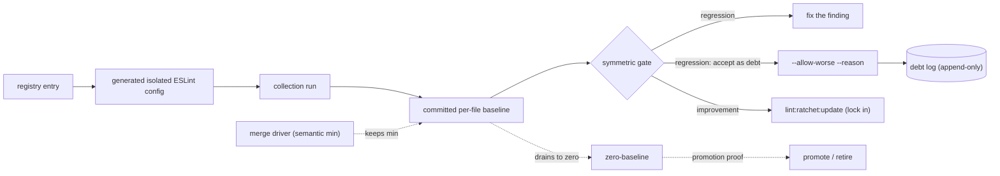

# Lint System Overview

Start here if you are new to the repo's lint setup. This guide maps the parts,
shows where they run, and explains why the system is shaped this way. It links
into the deep references rather than duplicating them.

The one-sentence summary: **normal lint is a strict, always-green floor; known
debt lives in committed, item-keyed baselines that can only shrink; and every
diagnostic carries enough metadata that a human or an AI agent can repair it
without tribal knowledge.**

## The pipeline at a glance

A ratchet flows left to right: a **registry entry** names a rule and its file
scope; the runner writes a **generated isolated ESLint config** for it, does a
**collection run**, and diffs the result against the **committed per-file
baseline**. The **symmetric gate** then fails on any uncommitted change in
either direction — a regression must be fixed or explicitly accepted as debt,
and an improvement must be locked in. Two side rails support the baseline: a
git **merge driver** keeps the semantic minimum across branches, and the
append-only **debt log** records every accepted regression. Draining a baseline
to zero is a lifecycle event, not an end state.

## The parts

| Part | Lives in | What it does |
| --- | --- | --- |
| ESLint flat config | `eslint.config.js` + `eslint-config/` | The strict lint floor. `eslint.config.js` composes an ordered set of config fragments from the `eslint-config/` modules (base, code quality, package boundaries, client framework, scripts, tests, config files). Focused path/glob, script/test, package-boundary, and max-lines policy modules share the declarative `config-surface-manifest.json` vocabulary where needed; external adopters should follow the [config-surface consumer chain](lint-ratchet-adoption.md#config-surface-manifest-adoption), not copy the manifest alone. `no-restricted-syntax` is the exception to the fragment pattern: its whole policy is data in `eslint-config/restricted-syntax-policy.js`, composed by `eslint-config/restricted-syntax-builder.js` — see [add-restricted-syntax-fence.md](add-restricted-syntax-fence.md). |
| Local rules | `eslint-rules/` (registered via `eslint-config/local-plugin.generated.js`) | Repo-specific `local/*` rules encode Musi policy: concurrency guards, tRPC schema contracts, socket broadcast rules, type-assertion boundaries, structured logging, and more. Each rule ships with unit tests and machine-readable `meta.docs` guidance; see the generated rule catalog for the current set. |
| Rule catalog (generated) | `docs/generated/local-lint-rules.md` | Generated from each rule's `meta.docs` by `bun run docs:lint-guidance`; grouped by maintainability / architecture fitness / behavior, with a principle and repair path per rule. |
| Lint ratchet | `scripts/lint-ratchet/` + `lint-ratchet.baseline.json` | Tracks selected existing debt without letting it grow. `bun run lint:ratchet` fails on any regression against the committed baseline; `lint:ratchet:update` records intentional changes. Run `bun run lint:ratchet:summary` for the current ratchet list. See [Lint Ratchet](lint-ratchet.md). |
| Suppression registers | `scripts/lint-suppressions.sh` | Live scans that fail on any `eslint-disable`, `@ts-expect-error`, or Stryker suppression without a `-- reason`, and on broad disables outside an explicit allowlist. Rules currently under ratchet cannot be disabled at all (`eslint-config/ratchet-restricted-disable-rules.generated.js`). |
| Coverage map | `scripts/lint-coverage-map-manifest.ts` → `docs/generated/lint-coverage-map.md` | A typed inventory assigning every tracked file a status (`linted`, `ratcheted`, `excluded`, ...), checked by `bun run docs:lint-coverage-map:check` so no surface goes silently unlinted. The Markdown table is generated from the manifest; edit the manifest, not the document. |
| Agent envelope | `scripts/lint-agent.ts` | `bun run lint:agent:local-rules[:changed]` re-emits `local/*`, selected core/plugin steering findings, and parser errors as a structured `HarnessDiagnostics` JSON envelope (severity, principle, repair command) for AI-agent consumption. Rules without structured guidance remain info disclosures. Advisory view only — the ESLint gate stays the enforcement floor. |
| Non-ESLint floors | `scripts/lint-shell.sh`, `lint-config-sensors.sh`, `lint-import-cycles.sh`, `backlog-lint.ts` | ShellCheck for shell scripts; actionlint/yamllint/taplo/hadolint for workflow and config files; a runtime import-cycle floor; and the backlog note lint — `backlog-lint.ts` is the facade over a small stack that parses the repository's own backlog-note and pack grammar (canonical `Status:`/date headers plus named compatibility fallbacks, all declared in `backlog-lint-grammar.ts`), reports front-matter and index-vs-leaf drift advisories, and feeds the generated `docs/agent_notes/backlog/CATALOG.md` (`bun run docs:backlog-catalog[:check]`). The first three floors in this row run inside `scripts/lint.sh` and fail the commit gate; only the backlog clause is advisory — `backlog:lint` gates nothing, and a stale `CATALOG.md` merely warns at pre-commit, though `harness:check` (which `scripts/land.sh` and CI run) does fail on it. |
| AI post-edit hooks | `scripts/ai-hooks/` (wired in `.claude/settings.json`) | After an agent edits a file: auto-fix with ESLint/prettier, warn if the file is outside lint coverage, and advisory-check for new ratchet regressions — feedback at edit time, before any gate runs. |

## Where lint runs

Every gate runs the same generated step list (`scripts/verify/steps.generated.sh`);
what varies is scope:

- **Post-edit (agents)** — hooks auto-fix and advise on the single edited file.
  Nothing blocks here.
- **Pre-commit / `verify:changed`** — parallel slots: `lint:changed` (changed
  files only), suppressions, ratchet + zero-baseline + debt accounting,
  max-lines exceptions, coverage map (no reach probe), plus format, typecheck, and
  tests. The import-cycle floor always runs whole-tree because a cycle is a
  global property.
- **Full `verify` / CI** — same slots with full scope: whole-tree ESLint,
  shell + config sensors, and the coverage-map audit that verifies `linted`
  rows are actually reachable by the ESLint config. CI additionally posts a
  ratchet report as a sticky PR comment.

All ESLint gate runs use `--max-warnings=0`: a `warn` is editor-advisory
severity, not a non-blocking escape hatch. See
[severity semantics](local-eslint-rules.md#severity-semantics).

## Why it is set up this way

**Strict floor plus ratchets, instead of warnings.** Warning-level debt rots:
nobody owns it and it grows silently. Here the normal gate is binary and
always green, and known debt is quarantined into ratchets — per-item committed
baselines that fail the build if debt grows *or* if an improvement isn't
recorded. Debt can only trend down, and every change to it is a reviewable
diff.

**Baselines are committed and item-keyed.** `lint-ratchet.baseline.json` keys
findings per ratchet and file, so a regression in one file cannot hide behind
an improvement in another. Dedicated git merge drivers
(`lint:ratchet:install-merge-driver`) keep parallel branches from producing
nonsense baseline merges.

**Zero is a lifecycle event, not an end state.** When a ratchet drains to
zero, `lint:ratchet:zero-baseline` forces a decision: promote the rule into
the normal lint floor, narrow its scope with a documented disposition, or
retire it. A silently-zero ratchet can never linger.

**Suppressions are policy, not convention.** Every disable directive needs a
parseable reason; broad disables need an allowlist entry; ratcheted rules
cannot be disabled at all, because a disable comment would punch a hole in the
baseline accounting. The same shape applies to type assertions via
`local/type-assertion-boundary` and its five categories
([details](local-eslint-rules.md#type-assertion-boundary-marker)).

**Coverage is inventoried, not assumed.** New files land in the coverage map
with an explicit status, and the audit checks that "linted" means ESLint
actually reaches the file. The failure mode this prevents: tooling that lints
`src/` strictly while the scripts that gate the repo go unlinted for years.

**Diagnostics teach the fix.** Local rules must carry `meta.docs` metadata —
principle, category, paired guide, repair kind — enforced by
`eslint-rules/message-guidance.test.js`. That metadata generates the rule
catalog and the agent envelope, so both a new dev and an AI agent get the
"why" and the repair path with the finding, not just a rule id. This repo is
also a public harness-engineering reference, so the ratchet and guidance
pipeline are built to be copied ([adoption guide](lint-ratchet-adoption.md)).

**Exit codes carry tool verdicts.** Git truth-up and pre-push consumers branch
on documented dedicated exit codes; human diagnostic prose remains
presentation and is never a hidden policy API. Those consumers treat codes 1
and 2 as unclassified failures, so a runtime crash cannot be mistaken for a
stale baseline.

## Which doc to read when

| Situation | Read |
| --- | --- |
| A `local/*` rule flagged your change | [Rule catalog](../generated/local-lint-rules.md) — principle and repair path per rule |
| `lint:ratchet` failed | [Lint Ratchet](lint-ratchet.md) — commands and baseline lifecycle |
| A generated baseline conflicted during a merge | [Lint Ratchet Merge Runbook](lint-ratchet-merges.md) — drivers, truth-up, and recovery |
| Coverage-map check failed | [Coverage Map Gate](lint-ratchet-reference.md#coverage-map-gate) |
| Writing or changing a local rule | [Local ESLint Rules](local-eslint-rules.md) — authoring conventions, metadata contract |
| Adding a ratchet or draining one to zero | [Lint Ratchet](lint-ratchet.md#adding-a-ratchet) and the zero-baseline lifecycle section |
| The internals: metrics, baseline identity, hashing, parser profiles, CI parity | [Lint Ratchet Reference](lint-ratchet-reference.md) |
| You need a cast or a disable comment | [Type-assertion boundary marker](local-eslint-rules.md#type-assertion-boundary-marker); disables need `-- reason` |
| Copying the system to another repo | [Lint Ratchet Adoption](lint-ratchet-adoption.md), or [Biome Lint Adoption](biome-lint-adoption.md) for Biome |
| How lint fits the wider agent harness | [`docs/ai-harness.md`](../ai-harness.md) |

For a one-off question about a single rule's behavior, probe it in isolation
with `bun run lint:probe-rule` rather than reverse-engineering the full
config.
