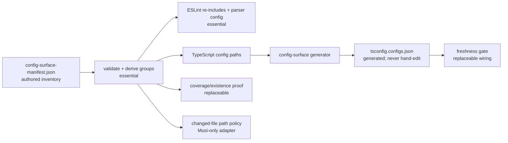

# Lint Ratchet Adoption

This guide is for projects outside this repository that want to copy and adapt
the lint ratchet. It presents two adoption tiers, explains the runtime copy
model for each, and names the ongoing ownership cost.

For the operator reference — commands, zero-baseline lifecycle, and adding a
ratchet — see [Lint Ratchet](lint-ratchet.md). For the internals — metrics,
baseline identity, parser profiles, CI parity, and the coverage map — see the
[Lint Ratchet Reference](lint-ratchet-reference.md).

For a ready-made worked copy to diff against,
[`examples/lint-ratchet-demo/`](../../examples/lint-ratchet-demo/) is a
clone-and-run proof that the runtime copies cleanly out of this repo.

## How the ratchet works

The ratchet has three pieces:

1. A **registry** of scoped rules. Each entry names the ESLint rule, source
   kind, parser profile, file globs, ignore globs, options, mode, metric, and
   repair kind.
2. A **committed per-file baseline**. `lint-ratchet.baseline.json` records each
   ratcheted file's current count or metric payload, plus config and rule-source
   hashes.
3. A **symmetric gate** that fails on both sides of drift. Regressions fail
   because current findings are above the committed floor; un-reflected
   improvements also fail because current findings are below the baseline and
   must be locked in with `lint:ratchet:update`.

The gate is the key property: debt cannot grow silently, and cleanup cannot go
unacknowledged.

### The item-keyed baseline pattern is reusable

The committed-baseline + symmetric-gate + three-way-merge machinery is not
ratchet-specific. Its item-keyed core lives in `scripts/lib/baseline/` as a
generic `Baseline<Metric>` framework (deterministic file with a derived
`summary` integrity check, a symmetric key-set gate, and a min-merge driver
with post-merge truth-up). A collector produces identity-keyed entries; the
framework owns everything downstream. The knip unused-export sensor is the
first consumer at tier-0: its floor is an **identity ledger** keyed by
`(category, path, symbol)` rather than a per-file count, so swapping one unused
symbol for another — invisible to a count-only floor — fails the gate. When you
adopt a second count-floor signal, reach for this shared framework instead of
re-deriving parse/compare/format a fourth time.

## Tier 1 — Minimal ratchet

The minimal tier gives you the gate, baseline, and registry. No agent envelope,
no coverage map, no post-edit hooks, no CI reporting. The runner still emits a
`HarnessDiagnostics` JSON envelope for machine-readable failures; "no agent
envelope" means you are not adopting the separate changed-file
`lint:agent:local-rules` pipeline.

### What to copy

Runtime files (all paths relative to repo root):

| File | Role |
| --- | --- |
| `scripts/lint-ratchet/portable-manifest.json` | Authoritative, machine-readable inventory for the core runtime, directory expansion/exclusions, and recommended merge-driver profile |
| `scripts/lint-ratchet.ts` | CLI entry point and re-exports |
| `scripts/lint-ratchet/lint-ratchet-config.ts` | Registry types, third-party plugin allowlist, and the `lintRatchets` array you edit |
| Every path selected by the manifest's `runtimeFiles` and `expandDirectories` | Runner internals and cross-directory dependencies; expansion exclusions keep tests, test helpers, and the Musi registry out of the copied runtime |
| Merge drivers (recommended): the manifest's `mergeDriverFiles` | Installs the semantic baseline merge, checks that the installed copy is current, and validates a completed merge before consuming its truth-up marker |
| `packages/shared/src/schemas/harness-diagnostics.ts` | Zod schema for the diagnostics envelope; copy at this path or move it and update the imports in the ratchet output, diagnostics, report, and copied tests |
| `lint-ratchet.baseline.json` | Start with `{ "version": 1, "tests": {} }` |

Do not maintain a second hand-written inventory. Both
`scripts/tests/test-lint-ratchet.sh` and
`scripts/lint-ratchet/output.test.ts` consume
`scripts/lint-ratchet/portable-manifest.json`; the output fixture additionally
copies the manifest's explicit `mergeDriverFiles` profile. The fixtures write
their own registry, so `lint-ratchet-config.ts` remains a documented adopter
replacement rather than a copied Musi configuration.

### Merge-driver wiring (recommended)

The copied merge-driver scripts need repository wiring before Git will use
them:

1. Add these rows to `.gitattributes`:

   ```gitattributes
   /lint-ratchet.baseline.json merge=lint-ratchet-baseline
   /lint-ratchet.debt-log.jsonl merge=union
   ```
2. Expose
   `"lint:ratchet:install-merge-driver": "bash scripts/git/install-lint-ratchet-merge-driver.sh"`
   as a package script. Run it from `prepare`, or once for every clone and
   worktree: the installer stores the driver in the Git common directory.
3. Invoke `scripts/git/lint-ratchet-post-merge-baseline-truth-up.sh` from the
   repository's `post-merge` hook. Also invoke it with the `post-commit`
   argument from `post-commit`, so a marker left by a completed cherry-pick or
   rebase is validated and consumed.

See the [Lint Ratchet Merge Runbook](lint-ratchet-merges.md) for why a textual JSON
merge is unsafe and how the semantic minimum merge and truth-up check preserve
the stricter floor. The runtime's merge-driver advisory runs only during
`lint:ratchet:update` and `lint:ratchet:check-baseline`; if
`scripts/git/check-lint-ratchet-merge-driver.sh` was not copied, that advisory
silently skips, so omitting the merge-driver files also omits the warning.

### Runtime assumptions

The copied runner is portable, but not package-manager neutral internals. It
currently assumes:

- a Git repository, because registry preflight, collection, zero-baseline
  checks, and the coverage-map companion use `git ls-files`;
- intended ratchet files are tracked before you rely on empty-glob, collection,
  or lifecycle checks; untracked matching files are not counted by the ratchet
  gate;
- a classic `node_modules` layout for package-version reads and cache storage:
  the runner resolves ESLint's installed JavaScript entry and launches it with
  `process.execPath`, while plugin and ESLint versions are read from
  `node_modules/<package>/package.json` and generated configs/caches live under
  `node_modules/.cache/eslint-ratchet/`;
- a POSIX environment with `bash`: the merge-driver presence check spawns it,
  and installers and Git hooks are shell scripts. Native Windows is untested;
  use WSL as the expected adoption path;
- generated isolated ESLint configs, not the project's normal flat config with
  one extra rule enabled. Rules that need project `settings`, globals,
  processors, import resolvers, or custom TypeScript project setup need
  `scripts/lint-ratchet/eslint-config.ts` changes;
- relative `files` and `ignores` patterns evaluated by Minimatch with
  `{ dot: true }`, so normal minimatch syntax and dot-prefixed paths are
  supported. Registry preflight checks every `files` pattern against tracked
  files and reports a `dead-glob` when any one matches nothing, then checks the
  combined scope after ignores; `allowEmpty: true` waives both checks.

Yarn PnP, global ESLint installs, non-Git source trees, and unusual cache roots
are supportable, but they require adapter changes rather than only package
script changes.

### What to change

1. **Replace the registry.** Remove the Musi-specific imports from
   `scripts/lint-ratchet/lint-ratchet-config.ts` (shared-policy globs and registry builders),
   clear `lintRatchets`, keep the exported types, and add one entry:

   ```ts
   export const lintRatchets = [
     {
       id: "ratchet/core-no-console-src",
       ruleId: "no-console",
       source: { kind: "core" },
       parserProfile: "minimal-ts",
       files: ["src/**/*.ts", "src/**/*.tsx"],
       ignores: ["src/**/*.test.ts", "src/**/*.test.tsx", "src/generated/**"],
       ruleOptions: [{ allow: ["warn", "error"] }],
       mode: "no-new",
       metric: "message-count",
       repairKind: "manual",
       principle: "Keep console output from growing beyond today's intentional logging and debug debt.",
     },
   ] as const satisfies readonly LintRatchetConfig[];
   ```

   Use `mode: "no-new"` (the only mode) so the entry writes a committed floor
   and fails on unacknowledged drift. Before committing a new entry, you can run
   `bun run lint:ratchet -- --propose <ruleId> <glob...>` for a core or
   `local/<rule-name>` rule to print current counts and the would-be baseline
   without editing the registry or committed baseline — the discovery use case
   the removed `report-only` mode once served.

2. **Clear the third-party allowlist** unless you are ratcheting third-party
   plugin rules from the start.

3. **Delete or stub `scripts/lint-ratchet/registry-builders.ts`** after the
   registry no longer imports it. The builder functions are convenience
   abstractions over raw registry entries and are not required.

4. **Stub `scripts/lib/lint-rule-docs.ts` if you are not adopting local rules.** The
   CLI modes still import the loader so `local/*` ratchets can be validated. A
   core-only or third-party-only setup can keep a same-export stub that returns
   no entries:

   ```ts
   export interface RuleDocsEntry {
     readonly id: string;
     readonly principle: string;
     readonly pairedGuide: string;
     readonly repairKind: "autofix" | "codemod" | "manual" | "suggestion";
     readonly repairCommand?: string;
   }

   export interface RuleDocsFailure {
     readonly id: string;
     readonly failures: readonly string[];
   }

   export function formatRuleDocsFailures(failures: readonly RuleDocsFailure[]): string {
     return failures.map((failure) => `${failure.id}: ${failure.failures.join("; ")}`).join("\n");
   }

   export async function loadLintRuleDocs(_repoRoot: string): Promise<{
     readonly entries: readonly RuleDocsEntry[];
     readonly failures: readonly RuleDocsFailure[];
   }> {
     return { entries: [], failures: [] };
   }
   ```

5. **Update the `harness-diagnostics.ts` import path** if you move the schema
   file. Find every importer in the copied set with
   `rg -l 'schemas/harness-diagnostics' <copied files>` rather than trusting a
   hand-maintained list — the schema is imported from the ratchet runtime, the
   report and info diagnostics, the sidecar writer
   (`scripts/harness/harness-diagnostics-output.ts`), and the portable tests. If
   you do not need the structured envelope at all, replace the schema and
   summary helper with a project-local equivalent before dropping Zod.

6. **Add package scripts:**

   ```json
   {
     "baseline:restore-stage": "bash scripts/git/restore-generated-baseline-stage.sh",
     "lint:ratchet": "bun scripts/lint-ratchet.ts",
     "lint:ratchet:check-baseline": "bun scripts/lint-ratchet.ts --check-baseline",
     "lint:ratchet:check-registry": "bun scripts/lint-ratchet.ts --check-registry",
     "lint:ratchet:install-merge-driver": "bash scripts/git/install-lint-ratchet-merge-driver.sh",
     "lint:ratchet:report": "bun scripts/lint-ratchet.ts --report",
     "lint:ratchet:summary": "bun scripts/lint-ratchet.ts --summary",
     "lint:ratchet:trend": "bun scripts/lint-ratchet.ts --trend",
     "lint:ratchet:update": "bun scripts/lint-ratchet.ts --update",
     "lint:ratchet:zero-baseline": "bun scripts/lint-ratchet.ts --zero-baseline"
   }
   ```

   The main runtime path uses plain TypeScript rather than Bun-only APIs, but
   the portability fixtures exercise only `bun`. Treat `npx tsx`,
   `pnpm exec tsx`, and other runners as untested substitutions.

7. **Run the adoption sequence.** Use a Git worktree with the intended files
   tracked:

   ```sh
   bun run lint:ratchet:check-registry   # prove the registry is valid
   bun run lint:ratchet:install-merge-driver # install the semantic Git driver
   bun run lint:ratchet:update           # generate the initial baseline
   bun run lint:ratchet                  # prove the gate passes
   ```

### What to copy for tests

The minimum portable test set:

- `scripts/lint-ratchet/baseline.test.ts` — baseline building, parsing,
  comparison, update decisions, diagnostics formatting, hashing, and registry
  validation with fixture data.
- `scripts/lint-ratchet/summary.test.ts` — summary reduction and table
  formatting with fixture baselines.
- `scripts/lint-ratchet/output.test.ts` — consumes the portable
  manifest, copies runtime files into a temporary repo, writes a small core-rule
  registry, runs the CLI, and verifies `HARNESS_DIAGNOSTICS_OUTPUT` behavior
  without project app state.
- `scripts/lint-ratchet/check-registry.test.ts` — the portable cases test
  synthetic failure modes (empty globs, absolute paths, orphan baselines,
  deterministic ordering, absent-baseline). Replace the Musi-specific
  `accepts the Musi registry fixture` case with an equivalent smoke test for
  your own registry.

### What you own afterward

- **Baseline maintenance.** Renames move baseline keys; improvements require
  `lint:ratchet:update`. Both are mechanical but must happen in the same commit
  or PR as the source change.
- **Zero-baseline decisions.** When a ratchet reaches zero findings, you decide
  whether to promote the rule into normal ESLint, keep the ratchet with a
  documented disposition, or narrow the scope. The
  `lint:ratchet:zero-baseline` gate enforces this.
- **Registry coherence.** Adding, removing, or changing a ratchet entry requires
  `lint:ratchet:update` to refresh the baseline. The `check-registry` preflight
  catches structural problems before an ESLint run.
- **Dependency updates.** Rule-source hashes fold in dependency identity, so
  upgrades re-baseline explicitly instead of silently shifting counts. An ESLint
  upgrade re-keys every ratchet. A typescript-eslint upgrade also re-keys every
  ratchet (every generated config parses with `tseslint.parser`). A
  ratcheted third-party plugin upgrade re-keys that plugin's ratchets. A
  TypeScript upgrade re-keys type-aware (`type-aware-ts`) third-party ratchets. tsconfig
  edits are not hashed (see the "Baseline identity" section of
  `docs/guides/lint-ratchet-reference.md`): they shift type-aware findings and surface as a
  plain gate failure that `lint:ratchet:update` clears. The gate fails until you
  re-baseline, so every re-key is explicit.
- **Portable test upkeep.** Update `portable-manifest.json` when a runtime,
  expansion exclusion, or merge-driver dependency changes; both fixture
  consumers verify the resulting copy set.

### Staying in sync

Copy-paste adoption has no automatic upgrade path. That is the deliberate cost
of copying a reference instead of depending on a published package: you own a
fork, and upstream correctness fixes do not flow to you on their own.

The exact set of files you copied is enumerable from one committed file,
`scripts/lint-ratchet/portable-manifest.json`: its `runtimeFiles`, the
`expandDirectories` expansion (applying each entry's exclusions), and
`mergeDriverFiles`. Use that list as your sync anchor.

To pull upstream correctness fixes:

1. Resolve the copied paths from the manifest as above.
2. Watch this repo's history for changes to them —
   `git log -- <paths from the manifest>` — and diff each changed file against
   your copy.
3. Cherry-pick or hand-apply the fixes, reconciling against any local edits you
   made. You own the reconciliation, because you own your fork.

If you re-copy the runtime wholesale, regenerate the baseline afterward with
`lint:ratchet:update`, since renames and counts may have shifted upstream.

Note: a CI check that force-bumps the manifest's `version` on every runtime-file
change, or a version-keyed portable-set changelog, could make this less manual —
but both are deliberately out of scope until real downstream adopters exist. The
`version` field is currently a schema-compat guard, not a change counter, and
there is no external audience yet to justify the enforcement.

## Tier 2 — Full platform

The full tier adds the coverage map, agent envelope, post-edit hooks, CI
reporting, and custom guidance pipeline on top of Tier 1.

### Additional pieces

| Surface | Key files | What it does |
| --- | --- | --- |
| Coverage map | `scripts/lint-coverage-map-check.ts`, `scripts/lint-coverage-map-check-eslint-reach.ts` | Proves every tracked maintained file is accounted for by a lint owner (normal lint, ratchet, exclusion, or named blocker). Catches stale map rows, unknown ratchet ids, and ESLint reach gaps. |
| Agent envelope | `scripts/lint-agent.ts`, `scripts/lint-agent-guidance.ts`, `scripts/lint-agent-changed.sh`, `packages/shared/src/schemas/harness-diagnostics.ts` | Emits structured `HarnessDiagnostics` JSON for `local/*`, selected core/plugin steering findings, and parser errors, scoped to changed files. Non-overlaid findings remain info disclosures. Agents and hooks consume this selected view alongside full lint output. |
| Custom guidance | `scripts/lib/lint-rule-docs.ts`, `scripts/generate-lint-guidance.ts`, `docs/generated/local-lint-rules.md` | Validates and publishes `meta.docs` metadata from local rules: description, principle, category, paired guide, repair kind. |
| Post-edit hooks | `scripts/ai-hooks/tidy-edited-file.sh`, `scripts/ai-hooks/common.sh`, `.claude/hooks/`, `.codex/hooks/` | Runs Prettier + `eslint --fix` on files an agent just edited. Non-blocking, bounded, skips unsafe paths. |
| CI report | `lint:ratchet:report` command, CI workflow steps | Renders the diagnostics envelope as a GitHub step summary and sticky PR comment with recovery instructions. |

### Additional ownership cost

Everything in Tier 1, plus:

- **Coverage map maintenance.** When you add files, directories, or ratchets,
  update the map and run the map gate. The map is a committed Markdown table;
  the checker validates it structurally.
- **Local rule metadata.** Each `local/*` rule needs `meta.docs` with
  `description`, `principle`, `category`, `pairedGuide`, and `repairKind`. The
  guidance generator and agent envelope depend on this vocabulary.
- **Hook compatibility.** The post-edit hook runs per-file Prettier and ESLint.
  Formatter or import-sort ownership changes (e.g., moving to Biome) require
  hook updates.
- **CI workflow wiring.** The sticky PR comment, step summary, and artifact
  upload need workflow maintenance when you change action versions, repository
  permissions, or the diagnostics envelope shape.

## Config-surface manifest adoption

Musi keeps unusual maintained configuration files in
`eslint-config/config-surface-manifest.json`. The useful pattern is not the JSON
file by itself; it is one authored inventory feeding every consumer that must
agree about ESLint reach, TypeScript parser ownership, coverage, and freshness.
Copying only the manifest creates an inert list and loses that property.



### Minimum viable manifest

Start with only the maintained config files that broad ignore patterns or normal
package TypeScript projects would otherwise miss. For example:

```json
{
  "schemaVersion": 1,
  "surfaces": [
    {
      "path": "eslint.config.js",
      "language": "js",
      "group": "root-js",
      "coverageStatus": "linted"
    },
    {
      "path": "vitest.config.ts",
      "language": "ts",
      "group": "root-package-ts",
      "coverageStatus": "linted"
    }
  ]
}
```

The field names and group vocabulary are Musi policy, not a portable schema.
Keep them if they fit, or replace them with the smallest vocabulary that can
derive your ESLint and TypeScript scopes. Validate repo-relative paths,
supported languages/groups, duplicate entries, and claimed coverage status at
load time; a malformed inventory must fail rather than silently narrow lint.

### Consumer and replacement checklist

| Consumer | Adoption status | What the adopter must preserve or replace |
| --- | --- | --- |
| `eslint-config/config-surfaces.js` | Essential pattern | Load and validate the manifest once, then derive named path groups. Replace Musi's four groups and language/status enums with repository-local ones. |
| `eslint-config/shared-policy.js`, `base-configs.js`, and `config-file-configs.js` | Essential enforcement | Re-include globally ignored config files, give TypeScript configs a parser project, and verify every entry resolves an ESLint config. Adapt the surrounding flat-config modules rather than copying Musi's package globs. |
| `scripts/harness/generate-config-surfaces.ts` → `tsconfig.configs.json` | Essential for type-aware TS config files; otherwise omit | Generate the dedicated TypeScript project from the manifest's TS entries, or point those entries at an existing checked project. Keep one check mode that fails when the committed output is stale. |
| `scripts/lint-coverage-map-check.ts` | Replaceable proof | Musi checks that each manifest path is tracked and appears in the coverage map with the declared status. Use an equivalent inventory/reach check if the adopter has no Markdown coverage map. |
| `scripts/path-policy/path-policy.ts` | Musi-only adapter | It treats manifest entries as source-relevant changes for staged/changed gate routing. Map the inventory into the adopter's changed-file classifier, or omit this consumer when every gate is whole-tree. |
| `harness.controls.json`, `harness:check`, and pre-commit dependency-freshness tests | Musi-only wiring | Do not copy the control ids. Wire the generator's check command into the adopter's CI or commit gate and add a fixture proving a manifest edit selects that check. |

In Musi, only `tsconfig.configs.json` is generated by this chain. The manifest,
loader, ESLint policy, and consumer tests are authored. The coverage map is a
separate committed inventory that reads manifest entries during its check; it
is not emitted by the config-surface generator. Do not hand-edit the generated
tsconfig: change the manifest and run
`bun run harness:config-surfaces`, then require
`bun run harness:config-surfaces:check` in the freshness gate.

Before calling an adoption complete:

1. Add one JavaScript and, if applicable, one TypeScript config entry.
2. Prove `eslint --print-config <path>` succeeds for both and the intended rules
   are enabled.
3. Prove the TypeScript entry appears in the generated or replacement parser
   project.
4. Prove an absent, duplicate, unsupported, or unaccounted entry fails a check.
5. Prove changing the manifest makes the generated-output check fail until the
   output is refreshed.
6. Decide explicitly whether manifest edits select a changed-file gate; do not
   inherit Musi's path-policy machinery accidentally.

This solves one bounded inventory problem; it is not a repository-wide
configuration layer. Shell defaults, environment prefixes, runner assumptions,
and other copier-facing knobs remain separate. Musi keeps those knobs
discoverable with greppable `porting-knob:` source markers checked against a
"Porting This" checklist, so an undocumented knob fails the parity gate — a
convention an adopter can reuse for its own copier-facing assumptions.

## What is not portable

These pieces are intentionally Musi-specific and should not be copied verbatim:

- The `lintRatchets` array contents (Musi paths, dispositions, and
  builder-function indirection; the entry count shrinks as debt drains, so
  read the live registry rather than any snapshot).
- The `harness.controls.json` manifest and `missing-harness-ratchet` check
  (Musi's harness control inventory).
- The Biome adoption guide (`biome-lint-adoption.md`) — reference material for
  a future Biome adapter, not a current adoption path.
- Path-policy scripts (`scripts/path-policy/path-policy.ts`) and ESLint config
  internals (`eslint-config/`) — project-specific implementations. The
  [config-surface manifest pattern](#config-surface-manifest-adoption) is
  portable only when the adopter supplies the essential consumers and replaces
  or deliberately omits the Musi-only adapters above.

## Decision guide

Start with Tier 1 if:

- You have lint debt you want to freeze without a big-bang cleanup.
- You want pre-commit and CI enforcement that a specific rule is not getting
  worse.
- You do not have local ESLint rules or custom agent tooling.

Add Tier 2 when:

- You are writing local ESLint rules and want structured metadata and generated
  docs.
- You use AI coding agents and want them to receive lint findings as structured
  JSON with repair guidance.
- You want a committed inventory of which files are covered by which lint
  surface.
- You want CI to post a sticky PR comment with per-ratchet status and recovery
  commands.
